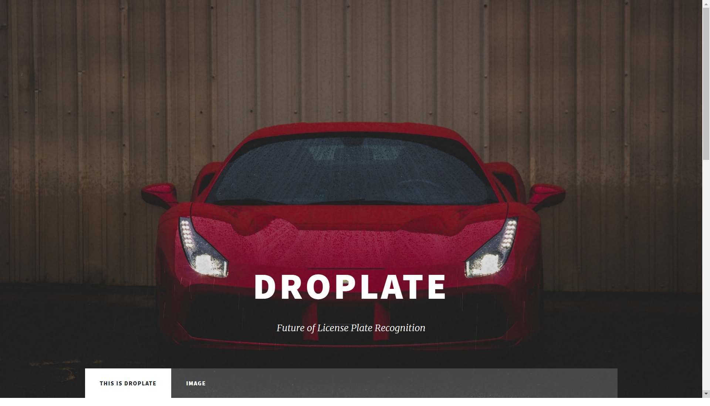
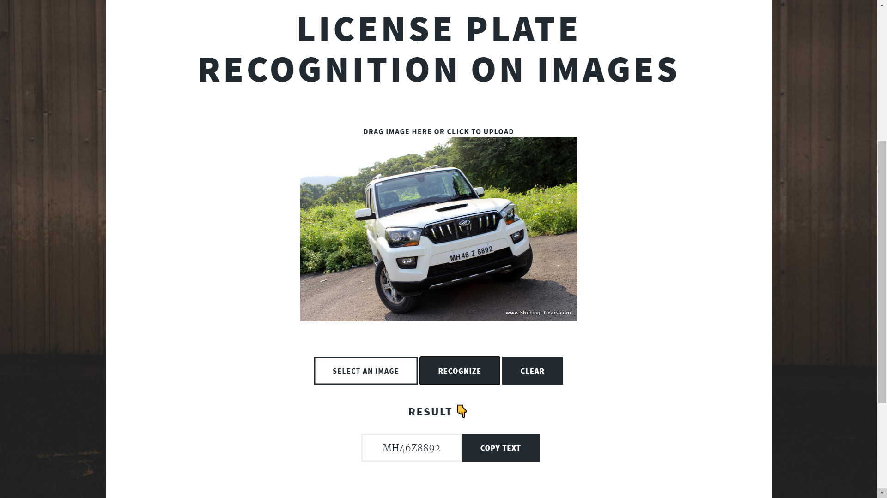
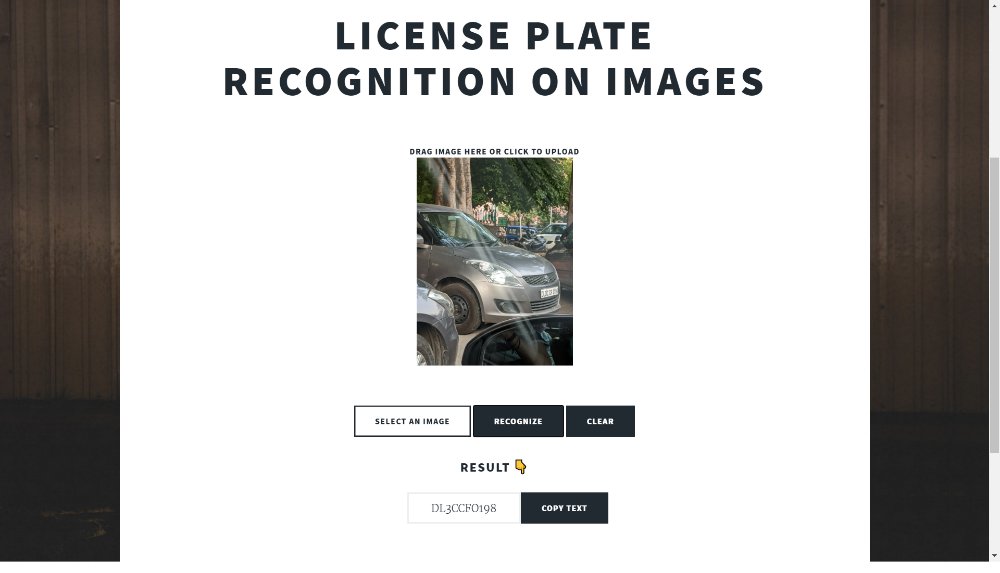
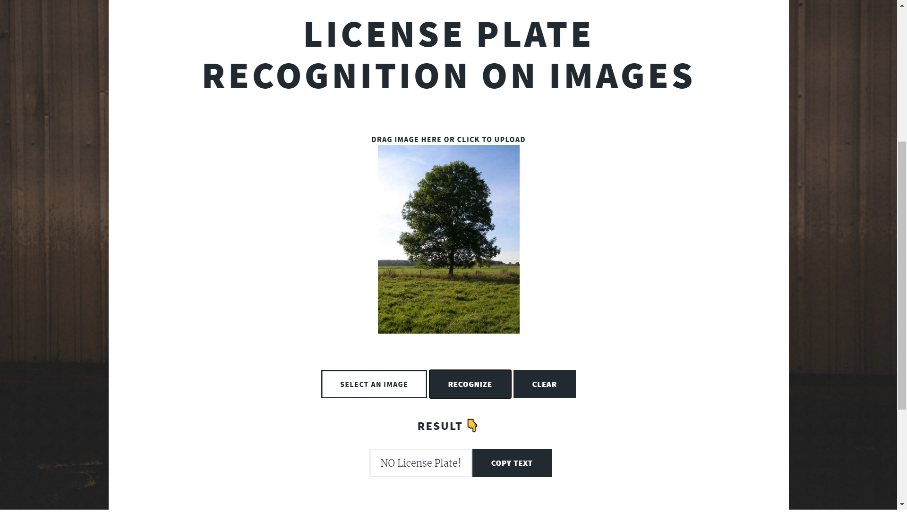

<h1 align="center"><b> Automatic Number Plate Recognition 🚗 </b></h1>
<h3 align="center"><b> http://licenseplaterecognitionv2.herokuapp.com </b></h3>

<h4 align="center"><b> BIDISHA MUKHERJEA | SUKKRIT SHARMA </b></h4>

## BACKGROUND

This is an online automatic number plate recognition tool which returns the license plate as the output text. It was built on Flask backend, YOLO v4 for the detection of license plates and our custom text recognizer which retrieves the number. 
  

## RESULT

  
  

  
  

  

